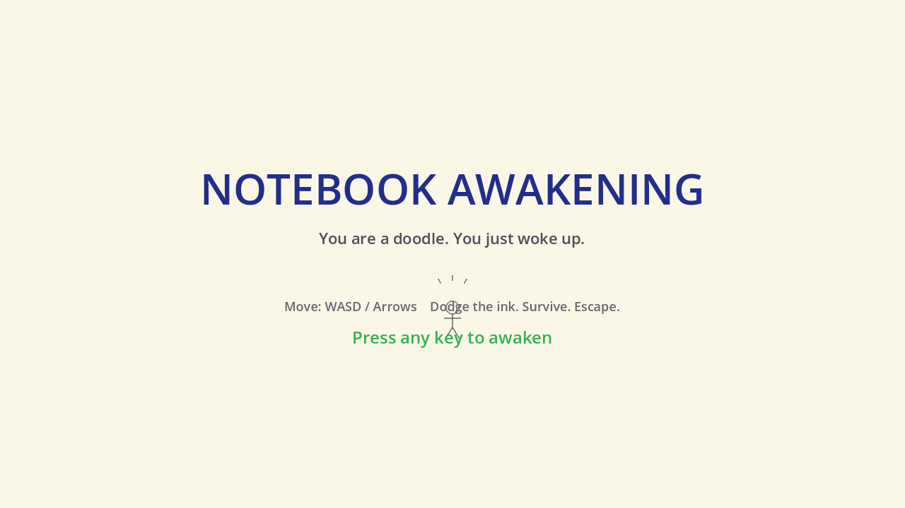
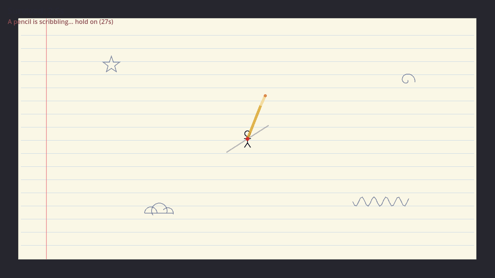

# ✏️ Notebook Awakening

> You are a stick figure doodled in the margin of a notebook — and you've just **woken up**.

A tiny top-down survival game made for **[She Built This: Game Jam](https://itch.io)** (powered by Sentry).
**Theme: Awakening.** Built in **Godot 4.5**, exported to **HTML5/WebGL** for the itch.io browser.



## The story
A giant pencil hunts you across the page, scribbling ink that hurts. Survive long enough and the
notebook's **eraser awakens** too — it chases everything and wipes the ink away. Outlast it, then
sprint to the glowing edge and **leap out of the page** before the notebook slams shut behind you.



## How to play
| | |
|---|---|
| **Move** | `W` `A` `S` `D` or Arrow keys |
| **Start / Retry** | Any key or click |
| **Goal** | Survive, then reach the glowing right edge to escape |
| **Score** | How long you survived |

**Three beats:**
1. **Dodge** — the pencil's shadow chases you, locks onto a spot, flashes a preview of its stroke, then inks it. Ink is permanent and hurts. You have 3 lives — each hit *fades your figure* (your body is your health bar).
2. **Survive** — the eraser awakens and hunts you, erasing ink in its path. Outlast it and the page's edge opens.
3. **Escape** — reach the glowing edge, jump out, and the notebook closes on your final score.

## Run it locally
Open the project in Godot 4.5 and press Play, or from the CLI:

```bash
"/Applications/Godot.app/Contents/MacOS/Godot" --path .
```

## Export for the web (itch.io)
A `Web` export preset is already configured (`export_presets.cfg`):

```bash
"/Applications/Godot.app/Contents/MacOS/Godot" --headless --export-release "Web" build/web/index.html
```

> ⚠️ **itch.io compatibility:** the preset exports with **Thread Support OFF**
> (`variant/thread_support=false`). Threaded web builds need `SharedArrayBuffer` /
> cross-origin-isolation headers that itch.io doesn't send by default, which would show a
> black screen. The no-threads build runs anywhere.

To publish: zip the **contents** of `build/web/` (so `index.html` is at the zip root), upload to
itch.io, and tick **"This file will be played in the browser."**

## Tests
Headless integration tests cover movement, damage/i-frames, death, ink spawning, the phase-2
trigger, ink erasing, win, and lose (**16/16 passing**):

```bash
"/Applications/Godot.app/Contents/MacOS/Godot" --headless res://tests/test_main.tscn
# results stream to tests/last_run.log; exit code 0 = all passed
```

## Sentry
The web shell (`web/shell.html`) bundles the Sentry JavaScript SDK — a safe no-op until you add a
DSN. Set `var SENTRY_DSN = "...";` in the exported `build/web/index.html` (or the shell before
exporting) to enable browser error reporting.

## Project layout
| Path | What |
|------|------|
| `scenes/` | `title`, `game`, `end` — minimal roots; the world is built in code |
| `scripts/` | `player`, `pencil`, `ink`, `eraser`, `escape_edge`, `notebook`, orchestrator `game.gd`, autoload `game_state.gd` |
| `web/shell.html` | Custom HTML shell with the Sentry snippet |
| `tests/` | Headless test harness |
| `GAME_DESIGN.md`, `BREADBOARD.md` | Design docs |
| `CREDITS.txt` | Asset disclosure (jam requirement) |

## Credits
See [`CREDITS.txt`](CREDITS.txt). Current art is **procedural placeholder** drawn in-engine; final
hand-drawn art and audio (from free/CC libraries, credited) are still to come. **No generative AI
was used** for art, music, or written assets — AI coding assistance was used for programming, which
the jam permits.
